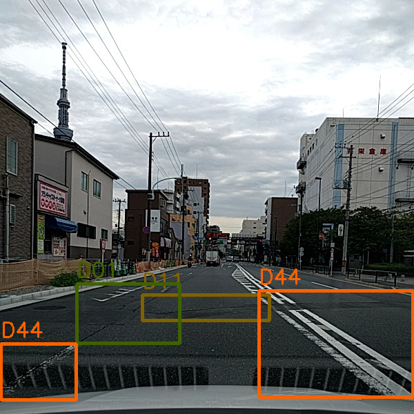

# Road Damage Detection and Classification with Faster R-CNN

### Introduction

This repository contains source files of *Road Damage Detection and Classification (RDDC)* based on Faster R-CNN, which achieves a Mean F1-Score of 0.6255 in the [Road Damage Detection and Classification Challenge](https://bdc2018.mycityreport.net) that held as one of the 2018 IEEE Big Data Cup.

It is developed based on the [tf-faster-rcnn](https://github.com/endernewton/tf-faster-rcnn) repository and created by Wenzhe Wang.



### Contents
1. [Requirements](#requirements)
2. [Installation](#installation)
3. [Setup Data](#setup-data)
4. [Submission](#submission)
5. [Training](#training)
6. [Analysis](#analysis)
7. [Citation](#citation)

### Requirements

1. A GPU with sufficient memory.

2. A basic Tensorflow installation (I use 1.4.0).

### Installation

1. Clone the tf-faster-rcnn-rddc repository into `$RDDC_ROOT`
	```Shell
	git clone https://github.com/zhezheey/tf-faster-rcnn-rddc.git
	```

2. Install python packages you might not have in `requirements.txt`
	```Shell
	# Python 3.4.3+ is needed
	pip install -r requirements.txt
	```

3. Update your -arch in setup script to match your GPU refer to [tf-faster-rcnn](https://github.com/endernewton/tf-faster-rcnn#installation)
	```Shell
	cd $RDDC_ROOT/lib
	# Change the GPU architecture (-arch) if necessary
	vim setup.py
	```

4. Build the Cython modules
	```Shell
	cd $RDDC_ROOT/lib
	make clean
	make
	```

5. Install the [Python COCO API](https://github.com/pdollar/coco)
	```Shell
	cd $RDDC_ROOT/data
	git clone https://github.com/pdollar/coco.git
	cd coco/PythonAPI
	make
	```

### Setup Data

1. Download the [RDDC](https://bdc2018.mycityreport.net/data/) dataset and convert it into PASCAL VOC 2007's annotation format. For convenience, you can also download the converted dataset [here](https://drive.google.com/open?id=1zu3yhcBt2WmQni5AEEsvj4UT8IOkSDOh).

2. Create symlinks for the converted PASCAL VOC dataset
	```Shell
	cd $RDDC_ROOT/data
	ln -s $road_damage_dataset VOCdevkit2007
	```

### Submission

Follow the steps below to reproduce the experimental results of our submission.

1. Download [our pre-trained model on RDDC](https://drive.google.com/open?id=1eP-Ca2zD1coxQI3K30u4zbth77NBocrR) and place them inside the `$RDDC_ROOT/output/res152/voc_2007_trainval/default` directory.

2. Get the submission
	```Shell
	cd $RDDC_ROOT/tools
	# Outputs are saved under $RDDC_ROOT
	python submmision.py
	```

### Training

1. Download pre-trained models and weights. The current code supports VGG16 and Resnet V1 models. Pre-trained models are provided by slim, you can get the pre-trained models [here](https://github.com/tensorflow/models/tree/master/research/slim#pre-trained-models) and put them under the `$RDDC_ROOT/data/imagenet_weights` folder. For Resnet152, you can set up like:
	```Shell
	mkdir -p $RDDC_ROOT/data/imagenet_weights
	cd $RDDC_ROOT/data/imagenet_weights
	wget -v http://download.tensorflow.org/models/resnet_v1_152_2016_08_28.tar.gz
	tar -xzvf resnet_v1_152_2016_08_28.tar.gz
	mv resnet_v1_152.ckpt res152.ckpt
	```

2. Augment the training data refer to `$RDDC_ROOT/analysis/data_augmentation_balance.ipynb`

3. Train
	```Shell
	cd $RDDC_ROOT
	./experiments/scripts/train_faster_rcnn.sh [GPU_ID] pascal_voc res152
	```
	**Note**: Please check that you have deleted the pre-trained models before training.

3. Visualization with Tensorboard
	```Shell
	cd $RDDC_ROOT
	tensorboard --logdir=tensorboard/res152/voc_2007_trainval/ --port=[PORT] &
	```

4. By default, trained networks are saved under:
	```
	$RDDC_ROOT/output/res152/voc_2007_trainval/default/
	```
	Tensorboard information is saved under:
	```
	$RDDC_ROOT/tensorboard/res152/voc_2007_trainval/default/
	$RDDC_ROOT/tensorboard/res152/svoc_2007_trainval/default_val/
	```

### Analysis

Some analyses during the competititon are under `$RDDC_ROOT/analysis`, see `$RDDC_ROOT/analysis/README.md` for details.

### Citation

Please consider citing the related papers and linking this project.
